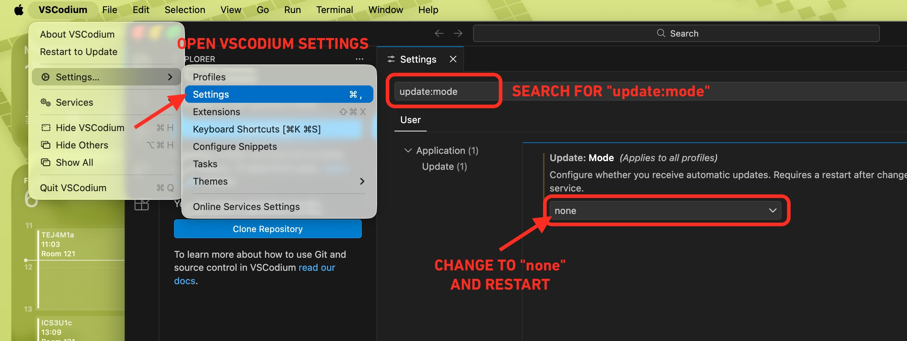

# Local IDE Setup

This guide walks you through installing the software you need for a local development environment in ICS3U.

You will need to install three things:

- [VSCodium](#1-vscodium)
- [Git](#2-git)
- [Java Development Kit (JDK)](#3-java-development-kit-jdk)

## 1. VSCodium

VSCodium is the code editor you will use to write, run, and manage your code.

**Download:** https://vscodium.com/#install

Click **Download latest release** at the top, then scroll down to find the release for your operating system (Windows, macOS, Linux) and processor architecture:
- **x86** for Intel processors
- **ARM** for Apple Silicon (M1/M2/M3) or Snapdragon

### Post-Install: Disable Automatic Updates

After installing VSCodium, change the update mode to `none` so it does not update automatically.

1. Open VSCodium.
2. Go to **VSCodium** > **Settings...** > **Settings** in the menu bar.
3. In the Settings search bar, type `update:mode`.
4. Change the **Update: Mode** dropdown to **none**.
5. Restart VSCodium.

## 2. Git

Git is the version control tool that VSCodium uses to sync your code with GitHub.

**Download:** https://git-scm.com/book/en/v2/Getting-Started-Installing-Git

Read the instructions carefully for your operating system. On macOS, the recommended approach is to install via Xcode Command Line Tools or Homebrew. On Windows, download and run the Git installer.

## 3. Java Development Kit (JDK)

The JDK is required to compile and run Java programs.

**Download:** https://www.oracle.com/java/technologies/downloads/#java21

Choose the version appropriate for your operating system and processor architecture (x86/x64 for Intel, ARM for Apple Silicon or Snapdragon).

## Next Steps

Once all three are installed, refer to the [Using GitHub guide](https://github.com/SACHSTech/Using-GitHub) to clone your first repository and get started with your workflow in VSCodium.
